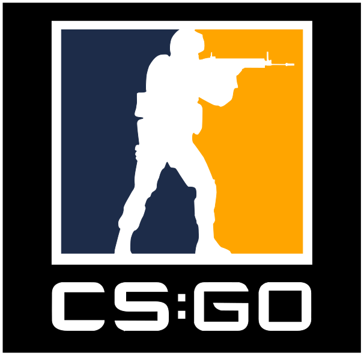

<h1 style="text-align : center" >CSGO Notes</h1> 

* You should practice at aim bot everyday, for a fair amount of time.
* Your sideways speed doesn’t reach its maximum immediately unless you run sideways for a fair amount of distance. Usecase:-
  * You should peek from a wall while while running side-ways from a fair amount of distance, instead of peeking right next to a wall.

